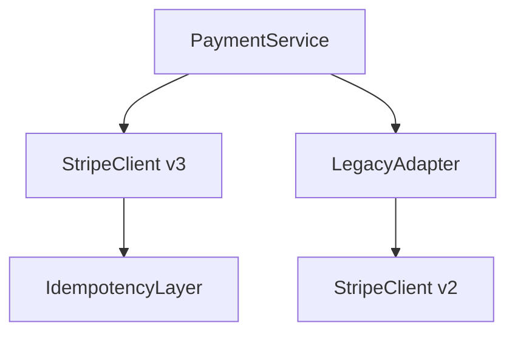

# PRD-C5: Plan 모드 (Plan Mode - 계획 승인 후 실행)

> **Phase**: C5 (C4 인프라 안정화 후)  
> **Priority**: 높음 (큰 작업 실패율 ↓)  
> **관련 PRD**: `PRD-C4_Infrastructure.md`, `PRD-Harness-04_Memories_Minimal.md`, `PRD-08_Codebase_Indexing.md`

---

## 1. Overview

### 목적
큰 작업(리팩터링, 마이그레이션, 새 기능) 전 **계획을 먼저 합의**하고 승인받은 뒤 실행한다. Cursor Plan 모드와 동등: 탐색 → 확인 질문 UI → 계획 문서(MD + Mermaid) → 사용자 편집/승인 → (선택) TODO 분기 → Agent 모드로 실행.

### 비즈니스 가치
- **재작업 방지**: "이게 맞나?" 확인 후 실행 → 되돌리기 비용 90% 감소
- **팀 협업**: 계획 문서로 리뷰/피드백 가능
- **중급 모델 보호**: Flash가 "일단 고치고 보자" 안 하게 강제

### 사용자 스토리
| ID | 스토리 |
|----|--------|
| US-01 | 개발자로서, "결제 모듈 리팩터링해줘" 하면 계획서(Mermaid 포함) 보고 승인 후 실행하게 하고 싶다 |
| US-02 | 팀 리더로, 계획서에서 "이 부분은 이렇게 하면 안 돼" 코멘트 달고 수정 후 승인하고 싶다 |
| US-03 | 개발자로서, 계획의 일부 TODO만 별도 Agent 세션으로 분기시켜 병렬 처리하고 싶다 |

---

## 2. Functional Requirements

### 2.1 Plan 모드 루프
```
탐색(읽기만)
  → 확인 질문 UI (객관식, ask_question)
  → 계획 문서 저장 (워크스페이스 .md)
  → 사용자 편집·승인
  → (선택) TODO 분기 → 새 Agent 세션
  → Agent 모드로 실행
```

### 2.2 도구 화이트리스트 (Plan 모드)
| 도구 | 허용 | 비고 |
|------|------|------|
| `grep`, `glob`, `list_dir`, `read_file` | ✅ | 탐색용 |
| `codebase_search`, `lsp_*` | ✅ | 의미 탐색 |
| `ask_question` | ✅ | **필수** — 객관식 UI로 확인 |
| `todo_write` | ✅ | 계획 단계 가시화 |
| `switch_mode` | ✅ | Agent 모드 전환용 |
| `edit_file`, `write_file`, `delete_file` | ❌ | **완전 차단** (계획 단계) |
| `run_terminal_cmd` | ❌ | **완전 차단** |
| `browser_*` | ❌ | **완전 차단** |

### 2.3 계획 문서 스키마 (`.agentk/plans/PLAN-<slug>.md`)
```markdown
# Plan: Refactor Payment Module

## Context
- Issue: #1234
- Goal: Migrate from Stripe v2 to v3, add idempotency

## Questions (asked & answered)
1. **Scope**: Full migration or wrapper? → **Full migration**
2. **Breaking changes**: Acceptable? → **No, backward compatible required**
3. **Timeline**: When to deploy? → **Next sprint**

## Architecture (Mermaid)


## TODOs
- [ ] Create StripeClient v3 with idempotency keys
- [ ] Add IdempotencyLayer (Redis)
- [ ] Write adapter for legacy webhooks
- [ ] Migrate unit tests
- [ ] Integration test with Stripe test mode
- [ ] Deploy to staging

## Risks
- Webhook signature verification change
- Idempotency key collision handling

## Approval
- [x] Approved by @tech-lead
- [ ] Ready for execution
```

### 2.4 확인 질문 UI (객관식)
| FR-ID | 요구사항 | 상세 |
|-------|----------|------|
| FR-01 | 질문 타입 | 단일 선택 / 다중 선택 / 자유 텍스트 (혼합 가능) |
| FR-02 | UI | 모달 드롭다운 + "기타(직접 입력)" 토글 |
| FR-03 | 필수/선택 | 필수 질문 미답변 시 계획 저장 불가 |
| FR-04 | 답변 기록 | 계획 문서 `## Questions` 섹션에 자동 기록 |
| FR-05 | 재질문 | 사용자 편집 후 재승인 시 미답변 질문만 다시 묻기 |

### 2.5 계획 승인 → 실행 분기
| FR-ID | 요구사항 | 상세 |
|-------|----------|------|
| FR-01 | 승인 버튼 | 계획 문서 상단 `[Approve & Execute]` 버튼 |
| FR-02 | TODO 분기 | 계획의 특정 TODO 항목 우클릭 → `Branch to new Agent` → 새 세션에서 해당 TODO만 수행 |
| FR-03 | 컨텍스트 계승 | 승인 시 계획 문서 + Q&A + Mermaid → Agent 모드 초기 컨텍스트로 주입 |
| FR-04 | 실행 모드 전환 | 승인 시 자동 `switch_mode('agent')` + 계획 컨텍스트 주입 |

---

## 3. Non-Functional Requirements

| NFR-ID | 항목 | 목표 |
|--------|------|------|
| NFR-01 | 질문 UI 응답 대기 | 무제한 (사용자 입력까지 대기) |
| NFR-02 | 계획 문서 저장 | 워크스페이스 `.agentk/plans/` 자동 저장, Git 관리 가능 |
| NFR-03 | Mermaid 렌더링 | 웹뷰에서 실시간 프리뷰 (mermaid.js) |

---

## 4. Technical Spec

### 4.1 Plan 모드 에이전트 (`src/agent/planAgent.ts`)

```typescript
export class PlanAgent {
  constructor(
    private loop: AgentLoop,
    private planStore: PlanStore,
    private questionUI: QuestionUI
  ) {}

  async run(goal: string): Promise<PlanResult> {
    // 1. 탐색 단계 (Ask 모드와 동일: 읽기 도구만)
    const exploration = await this.explore(goal);
    
    // 2. 확인 질문 생성 (LLM이 질문 리스트 생성)
    const questions = await this.generateQuestions(goal, exploration);
    if (questions.length > 0) {
      const answers = await this.questionUI.ask(questions);
      if (answers.cancelled) return { cancelled: true };
    }

    // 3. 계획 문서 생성 (Mermaid 포함)
    const plan = await this.generatePlan(goal, exploration, questions);
    
    // 4. 사용자 편집/승인 (웹뷰)
    const approved = await this.showPlanEditor(plan);
    if (!approved) return { cancelled: true };

    // 5. 승인 → Agent 모드 전환 + 컨텍스트 주입
    return this.transitionToAgent(plan);
  }

  private async generateQuestions(goal: string, exploration: ExplorationResult): Promise<Question[]> {
    const prompt = `Based on the exploration results, generate 3-5 clarifying questions for the plan.
Goal: ${goal}
Exploration summary: ${exploration.summary}
Files explored: ${exploration.files.join(', ')}

Output JSON: { questions: [{ id, text, type: 'single'|'multiple'|'text', options?: string[], required: boolean }] }`;
    
    const response = await this.llm.chatCompletion({ prompt, response_format: 'json_object' });
    return JSON.parse(response.content).questions;
  }

  private async showPlanEditor(plan: Plan): Promise<boolean> {
    // 웹뷰에서 계획 문서 편집 + Mermaid 프리뷰 + 승인 버튼
    return new Promise(resolve => {
      const panel = vscode.window.createWebviewPanel('planEditor', 'Plan: ' + plan.title, vscode.ViewColumn.One);
      panel.webview.html = this.getPlanEditorHtml(plan);
      panel.webview.onDidReceiveMessage(msg => {
        if (msg.type === 'approve') resolve(true);
        if (msg.type === 'cancel') resolve(false);
      });
    });
  }

  private async transitionToAgent(plan: Plan): Promise<PlanResult> {
    const agentLoop = this.loopFactory.create({ 
      mode: 'agent', 
      initialContext: this.buildAgentContext(plan),
      maxTurns: 25,
    });
    return { planId: plan.id, agentLoop };
  }
}
```

### 4.2 계획 문서 스토어 (`src/plans/planStore.ts`)

```typescript
export interface Plan {
  id: string;
  title: string;
  goal: string;
  context: string;
  questions: Question[];
  answers: Record<string, Answer>;
  mermaid: string;
  todos: TodoItem[];
  risks: string[];
  status: 'draft' | 'approved' | 'executing' | 'done';
  createdAt: number;
  approvedAt?: number;
}

export class PlanStore {
  private plansDir = vscode.Uri.joinPath(vscode.workspace.workspaceFolders![0].uri, '.agentk', 'plans');

  async save(plan: Plan): Promise<void> {
    await vscode.workspace.fs.createDirectory(this.plansDir);
    const file = vscode.Uri.joinPath(this.plansDir, `PLAN-${plan.id}.md`);
    const content = this.serialize(plan);
    await vscode.workspace.fs.writeFile(file, Buffer.from(content, 'utf8'));
  }

  private serialize(plan: Plan): string {
    return `# Plan: ${plan.title}

## Context
${plan.context}

## Questions & Answers
${plan.questions.map((q, i) => 
  `### Q${i+1}: ${q.text}\n**Answer:** ${plan.answers[q.id] || '—'}`
).join('\n\n')}

## Architecture
\`\`\`mermaid
${plan.mermaid}
\`\`\`

## TODOs
${plan.todos.map(t => `- [${t.done ? 'x' : ' '}] ${t.text} (${t.assignee || 'unassigned'})`).join('\n')}

## Risks
${plan.risks.map(r => `- ${r}`).join('\n')}

## Status
${plan.status}
`;
  }
}
```

### 4.3 질문 UI (`src/views/questionUI.ts`)

```html
<!-- Question Modal Webview -->
<div class="question-modal">
  <h3>Plan Clarification Questions</h3>
  <form id="questionForm">
    <div class="question" data-id="q1">
      <h4>1. Should we wrap Stripe v2 or fully migrate?</h4>
      <select name="q1" required>
        <option value="">Select...</option>
        <option value="full">Full migration (recommended)</option>
        <option value="wrap">Wrapper adapter</option>
        <option value="hybrid">Hybrid: v3 for new, v2 for legacy</option>
      </select>
      <label class="free-text">
        <input type="checkbox" name="q1-free"> Other (specify)
        <input type="text" name="q1-other" placeholder="Your answer..." disabled>
      </label>
    </div>
    <div class="question" data-id="q2">...</div>
    <div class="actions">
      <button type="button" class="secondary" onclick="cancel()">Cancel</button>
      <button type="submit" class="primary">Submit Answers</button>
    </div>
  </form>
</div>
```

---

## 5. UI/UX Specification

### 5.1 Plan 모드 진입
```
User: /plan Refactor payment module to use Strategy pattern

🔍 Exploring... (read-only tools)
  ├─ grep: "PaymentService" → 12 files
  ├─ read: src/payment/*.ts
  └─ lsp: references → 47 locations

❓ Clarifying Questions (3)
  1. Strategy interface: single method `execute()` or `execute(params)`?
     [execute(params) ▼]  [Other...]
  2. Legacy PaymentService: delete or keep as adapter?
     [Keep as adapter ▼]  [Delete]  [Other...]
  3. Tests: rewrite all or add new only?
     [Add new ▼]  [Rewrite all]  [Other...]

[Cancel]  [Submit & Generate Plan]
```

### 5.2 계획 에디터 (웹뷰)
```
┌─ Plan: Refactor Payment Module ────────────────────────────────────────┐
│  Status: 📝 Draft  |  [Approve & Execute]  [Cancel]                    │
├────────────────────────────────────────────────────────────────────────┤
│  ## Context                                                            │
│  Refactor PaymentService to Strategy pattern for multi-gateway.       │
│                                                                        │
│  ## Questions & Answers                                                │
│  ### Q1: Strategy interface...                                        │
  │  **Answer:** execute(params) — allows future extensibility          │
  │                                                                        │
  │  ## Architecture (Mermaid Live Preview)                              │
  │  ```mermaid                                                            │
  │  graph TD                                                              │
  │    A[PaymentService] --> B[PaymentStrategy]                          │
  │    B --> C[StripeStrategy]                                           │
  │    B --> D[PayPalStrategy]                                           │
  │    B --> E[MockStrategy]  ← Testing                                  │
  │  ```                                                                   │
  │                                                                        │
  │  ## TODOs                                                             │
  │  ☐ Create PaymentStrategy interface          [Branch]               │
  │  ☐ Implement StripeStrategy                  [Branch]               │
  │  ☐ Implement PayPalStrategy                  [Branch]               │
  │  ☐ Refactor PaymentService                  [Branch]               │
  │  ☐ Update tests                                  [Branch]           │
  │                                                                        │
  │  [Approve & Execute]  [Save Draft]  [Cancel]                          │
└────────────────────────────────────────────────────────────────────────┘
```

### 5.3 TODO 분기 (Branch)
```
Right-click on TODO "Implement StripeStrategy" → "Branch to new Agent"

🌿 New Agent Session: stripe-strategy
  Context: Plan #42 + TODO #2 only
  Mode: Agent
  Goal: Implement StripeStrategy per plan
  [Start Agent]
```

---

## 6. Acceptance Criteria

```gherkin
Feature: Plan Mode

  Scenario: Plan mode generates questions and plan document
    Given user runs "/plan Refactor PaymentService to Strategy pattern"
    When exploration completes
    Then 3 clarifying questions shown with dropdowns
    And user answers all
    Then plan document generated with Mermaid, TODOs, Risks
    And saved to .agentk/plans/PLAN-<id>.md

  Scenario: User edits plan before approval
    Given plan document open in editor
    When user changes Mermaid diagram and adds TODO
    And clicks "Approve & Execute"
    Then updated plan saved
    And Agent mode starts with updated plan as context

  Scenario: TODO branching creates isolated agent
    Given approved plan with 5 TODOs
    When user right-clicks TODO #3 → "Branch to new Agent"
    Then new Agent session starts with only TODO #3 context
    And parent plan shows TODO #3 as "🌿 Branched"

  Scenario: Plan without questions (simple task)
    Given user runs "/plan Add null check to UserService.getName"
    When exploration finds single file
    Then no questions generated (auto-skip)
    And plan generated directly for approval

  Scenario: Plan rejection returns to chat
    Given plan generated
    When user clicks "Cancel"
    Then returns to chat mode
    And plan saved as draft in .agentk/plans/
```

---

## 7. Implementation Checklist

| 단계 | 작업 | 완료 기준 |
|------|------|-----------|
| 1 | PlanAgent 루프 + 탐색(읽기만) + 질문 생성 LLM 프롬프트 | 질문 JSON 파싱 성공 |
| 2 | 질문 UI 웹뷰 (객관식/자유텍스트/필수검증) | 답변 수집 → 플랜 생성 |
| 3 | 플랜 문서 시리얼라이저 (MD + Mermaid) + 저장소 | `.agentk/plans/` 자동 저장 |
| 4 | 플랜 에디터 웹뷰 (Mermaid 실시간 프리뷰 + 편집 + 승인) | Mermaid 렌더링, 편집 반영 |
| 5 | `switch_mode('agent')` + 플랜 컨텍스트 주입 | Agent 모드에서 플랜 내용 인지 |
| 6 | TODO 분기 (Branch to Agent) + 컨텍스트 격리 | 별도 세션, 독립 실행 |
| 7 | Mermaid.js 웹뷰 임베드 + 실시간 렌더링 | 다이어그램 실시간 갱신 |
| 8 | 통합 E2E: 계획 → 승인 → 실행 → 분기 | 전체 플로우 CI 통과 |

---


## Out of Scope

- 해당 Phase 밖 기능을 완료로 간주하지 말 것 (특히 Browser=C7)
- 상세: `00_Master_Context.md` Non-Goals

## 8. References

- `PRD-C4_Infrastructure.md` — 승인 게이트, 체크포인트 재사용
- `PRD-Harness-04_Memories_Minimal.md` — 계획 문서를 메모리로 저장
- `PRD-08_Codebase_Indexing.md` — 탐색 단계에서 @codebase 활용
- Cursor Plan Mode: https://cursor.sh/docs/plan-mode