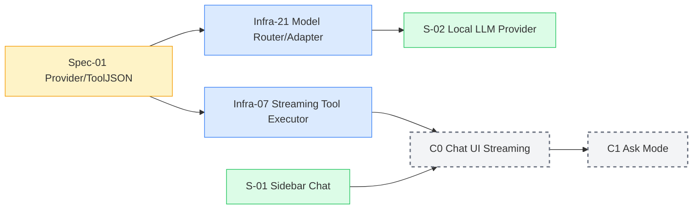
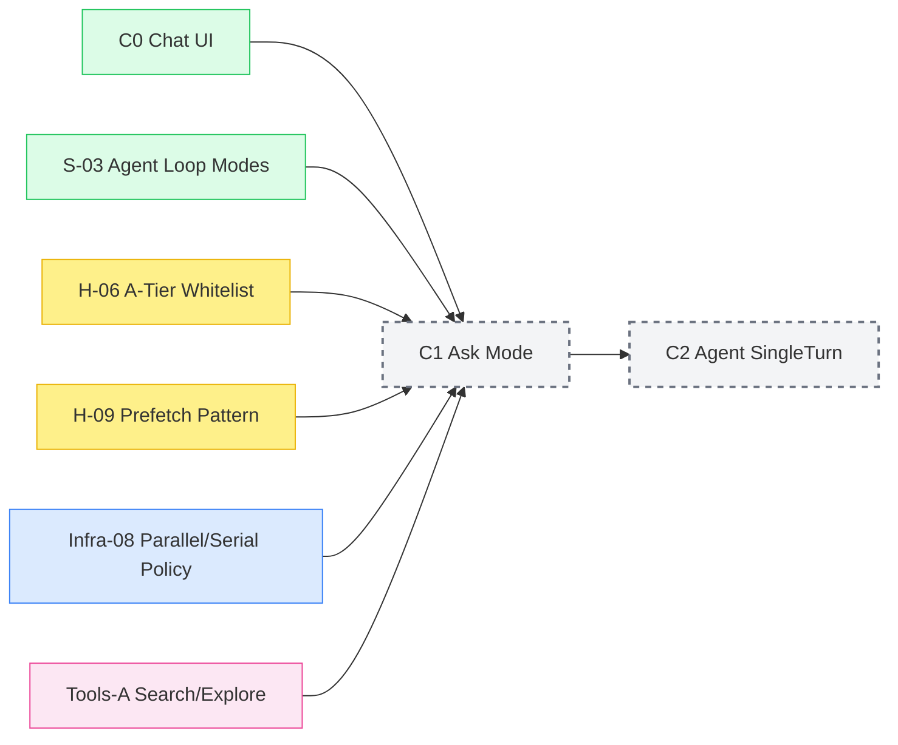
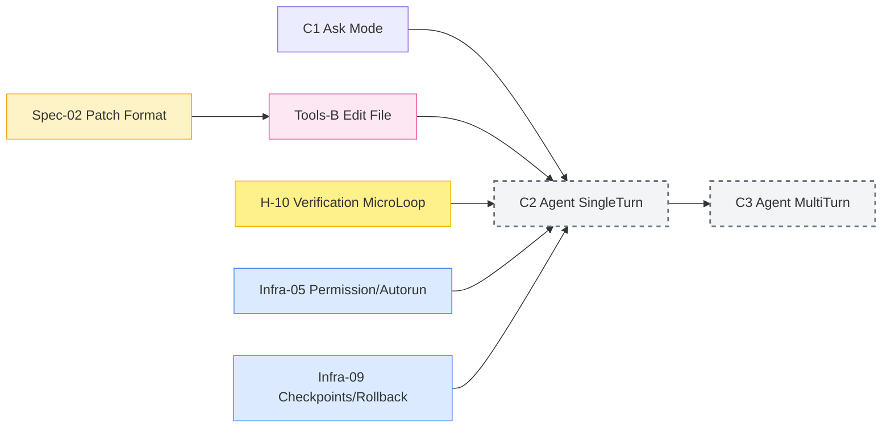
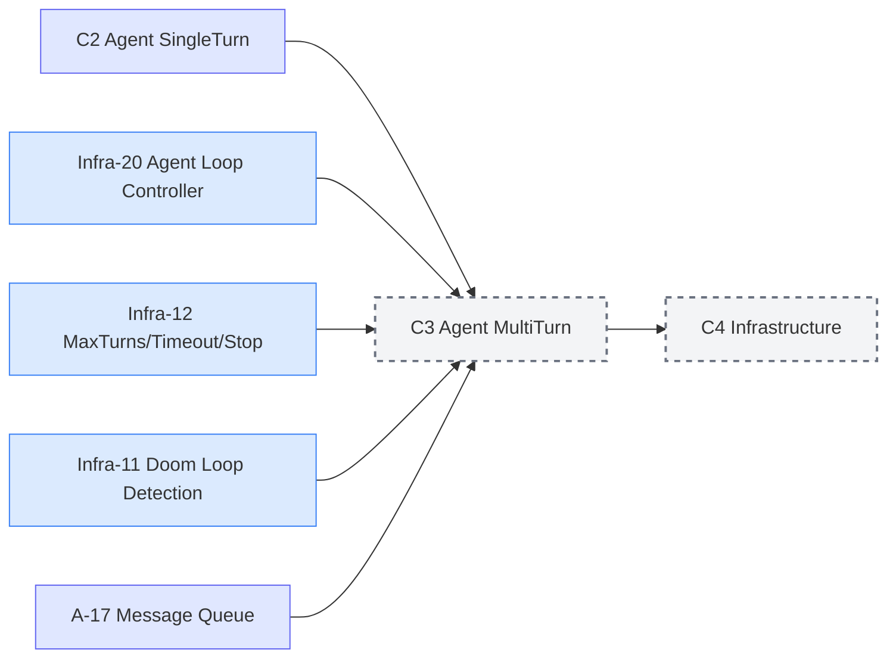
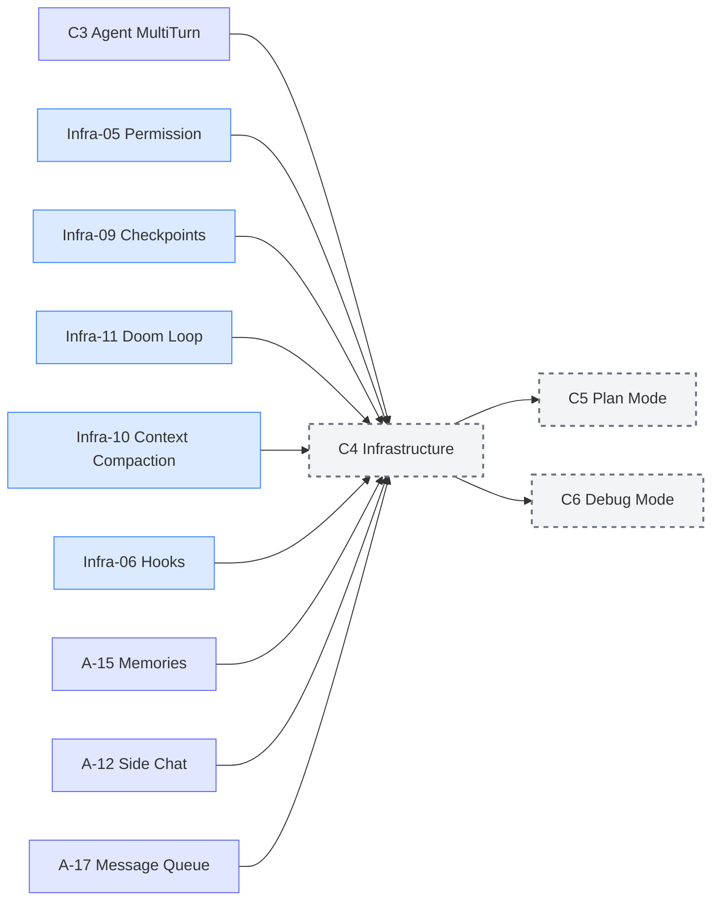
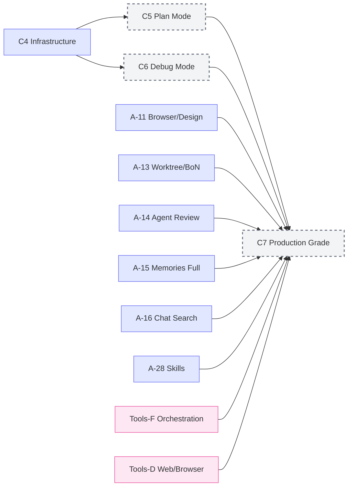
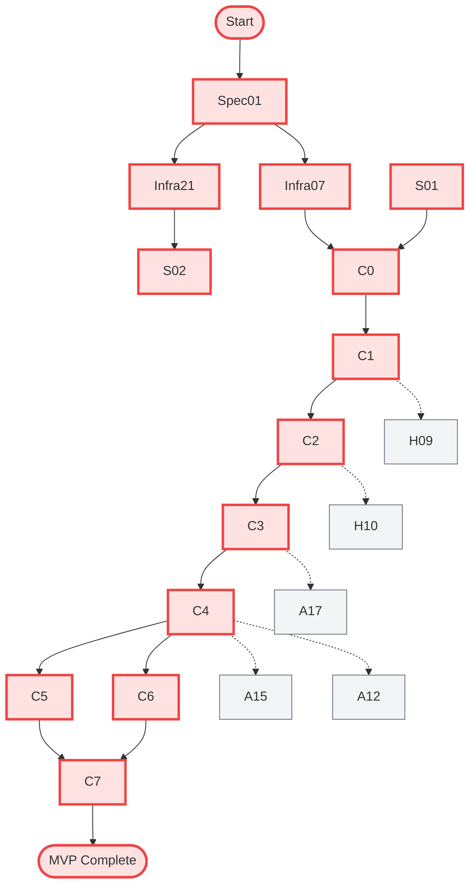
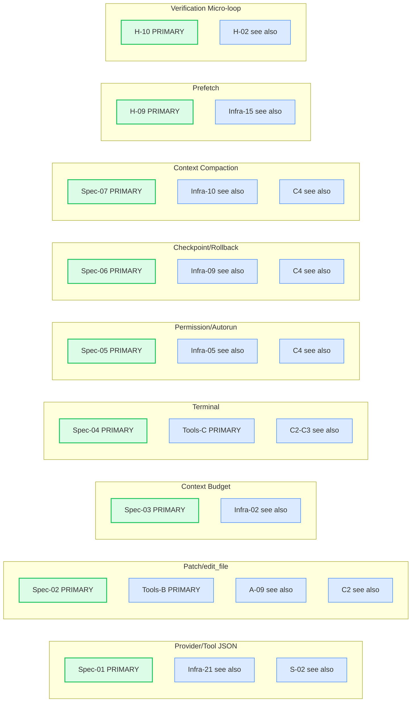

# PRD-Dependency-Graph: 문서 간 의존성 시각화

> **Purpose**: PRD 간 의존성을 Mermaid 그래프로 시각화하고, 위상 정렬(Topological Sort)로 구현 순서를 도출
> **Generated**: 2026-07-25 | **Total PRDs**: 90
> **Source**: Each PRD's `Dependencies` section + Canonical Owner Matrix

---

## 1. 전체 의존성 그래프 (Full Dependency Graph)

```mermaid
graph TD
    %% ===== LAYER 0: Foundation =====
    Spec01[PRD-Spec-01_Provider_ToolJSON]
    Spec02[PRD-Spec-02_Patch_Format]
    Spec03[PRD-Spec-03_Context_Budget]
    Spec04[PRD-Spec-04_Terminal_Execution]
    Spec05[PRD-Spec-05_Permission_Autorun]
    Spec06[PRD-Spec-06_Checkpoint_Rollback]
    Spec07[PRD-Spec-07_Context_Compaction]

    Infra01[PRD-Infra-01_Instructions_Rules]
    Infra02[PRD-Infra-02_Context_Assembly]
    Infra03[PRD-Infra-03_Indexing_SemanticSearch]
    Infra04[PRD-Infra-04_Tool_Registry]
    Infra05[PRD-Infra-05_Permission_Autorun]
    Infra06[PRD-Infra-06_Hooks]
    Infra07[PRD-Infra-07_Streaming_Tool_Executor]
    Infra08[PRD-Infra-08_Parallel_Serial_Policy]
    Infra09[PRD-Infra-09_Checkpoints_Rollback]
    Infra10[PRD-Infra-10_Context_Compaction]
    Infra11[PRD-Infra-11_Doom_Loop_Detection]
    Infra12[PRD-Infra-12_MaxTurns_Timeout_Stop]
    Infra13[PRD-Infra-13_Error_Recovery]
    Infra14[PRD-Infra-14_Tool_Call_Orchestration]
    Infra15[PRD-Infra-15_Prefetch_Pipeline]
    Infra16[PRD-Infra-16_Telemetry_Observability]
    Infra17[PRD-Infra-17_Extension_Lifecycle_Config]
    Infra18[PRD-Infra-18_Workspace_Indexer]
    Infra19[PRD-Infra-19_Session_Manager]
    Infra20[PRD-Infra-20_Agent_Loop_Controller]
    Infra21[PRD-Infra-21_Model_Router_Provider_Adapter]
    Infra22[PRD-Infra-22_Cost_Tracker_Budget_Guard]
    Infra23[PRD-Infra-23_Multi_Workspace_Remote]

    %% ===== LAYER 1: Tool Catalog =====
    ToolsA[PRD-Tools-A_Search_Explore]
    ToolsB[PRD-Tools-B_Edit_File]
    ToolsC[PRD-Tools-C_Terminal_Process]
    ToolsD[PRD-Tools-D_Web_Browser_Media]
    ToolsE[PRD-Tools-E_Session_UX]
    ToolsF[PRD-Tools-F_Orchestration_Extension]
    ToolsG[PRD-Tools-G_Debug_Tools]

    %% ===== LAYER 2: Harness =====
    H01[PRD-Harness-01_Model_Tiers]
    H02[PRD-Harness-02_Verification_First]
    H03[PRD-Harness-03_Cursor_Pattern]
    H04[PRD-Harness-04_Memories_Minimal]
    H05[PRD-Harness-05_Design_Slogans]
    H06[PRD-Harness-06_A_Tier_Whitelist]
    H07[PRD-Harness-07_Prompt_Turn_Structure]
    H08[PRD-Harness-08_Harness_Duties]
    H09[PRD-Harness-09_Prefetch_Pattern]
    H10[PRD-Harness-10_Verification_MicroLoop]
    H11[PRD-Harness-11_Context_Rules]
    H12[PRD-Harness-12_Routing_Heuristics]
    H13[PRD-Harness-13_UX_For_Medium]
    H14[PRD-Harness-14_Dont_Do_Medium]
    H15[PRD-Harness-15_Acceptance_Criteria]

    %% ===== LAYER 3: S-Tier Features =====
    S01[PRD-01_Sidebar_Chat_BYOLLM]
    S02[PRD-02_Local_LLM_Provider]
    S03[PRD-03_Agent_Loop_Modes]
    S04[PRD-04_Inline_Completion]
    S05[PRD-05_Selection_Diff_Apply]
    S06[PRD-06_Workspace_Tools]
    S07[PRD-07_Parallel_File_Search]

    %% ===== LAYER 4: A-Tier Features =====
    A08[PRD-08_Codebase_Indexing]
    A09[PRD-09_MultiFile_Apply_PatchReview]
    A10[PRD-10_MCP_Client]
    A11[PRD-11_Browser_Design_Mode]
    A12[PRD-12_Side_Chat]
    A13[PRD-13_Worktree_BestOfN]
    A14[PRD-14_Agent_Review_Bugbot]
    A15[PRD-15_Memories]
    A16[PRD-16_Chat_Search_Artifacts]
    A17[PRD-17_Message_Queue]
    A18[PRD-18_PR_Issue_Agent]
    A19[PRD-19_Test_Generation_FixLoop]
    A20[PRD-20_Commit_PR_Generation]
    A21[PRD-21_Secrets_Config_Vault]
    A28[PRD-28_Skills_Pinned]

    %% ===== LAYER 5: B-Tier Features =====
    B22[PRD-22_DGX_vLLM_Provider]
    B23[PRD-23_Model_Router]
    B23b[PRD-23b_Model_Router_AB_Tier]
    B24[PRD-24_Firmware_SVD_Register]
    B25[PRD-25_Legacy_Scan_Report]
    B26[PRD-26_MISRA_Lint_AI]
    B27[PRD-27_Serial_Monitor]

    %% ===== LAYER 6: Implementation Phases =====
    C0[PRD-C0_Chat_UI_Streaming]
    C1[PRD-C1_Ask_Mode]
    C2[PRD-C2_Agent_SingleTurn]
    C3[PRD-C3_Agent_MultiTurn]
    C4[PRD-C4_Infrastructure]
    C5[PRD-C5_Plan_Mode]
    C6[PRD-C6_Debug_Mode]
    C7[PRD-C7_Production_Grade]

    %% ===== EDGES: Foundation → Infra =====
    Spec01 --> Infra21
    Spec01 --> Infra07
    Spec02 --> ToolsB
    Spec02 --> Infra09
    Spec03 --> Infra02
    Spec04 --> ToolsC
    Spec05 --> Infra05
    Spec06 --> Infra09
    Spec07 --> Infra10

    %% ===== EDGES: Infra Interdependencies =====
    Infra01 --> Infra02
    Infra01 --> Infra20
    Infra02 --> Infra20
    Infra03 --> Infra18
    Infra04 --> Infra07
    Infra04 --> Infra20
    Infra05 --> Infra20
    Infra06 --> Infra07
    Infra06 --> Infra13
    Infra06 --> Infra20
    Infra07 --> Infra14
    Infra07 --> Infra20
    Infra08 --> Infra07
    Infra08 --> Infra14
    Infra09 --> Infra19
    Infra09 --> Infra20
    Infra10 --> Infra02
    Infra10 --> Infra20
    Infra11 --> Infra20
    Infra12 --> Infra20
    Infra13 --> Infra20
    Infra14 --> Infra20
    Infra15 --> Infra02
    Infra15 --> Infra20
    Infra16 --> Infra20
    Infra17 --> Infra20
    Infra18 --> Infra03
    Infra19 --> Infra20
    Infra21 --> S02
    Infra21 --> B22
    Infra22 --> Infra20
    Infra23 --> Infra20

    %% ===== EDGES: Infra → Tools =====
    Infra04 --> ToolsA
    Infra04 --> ToolsB
    Infra04 --> ToolsC
    Infra04 --> ToolsD
    Infra04 --> ToolsE
    Infra04 --> ToolsF
    Infra04 --> ToolsG
    Infra08 --> ToolsA
    Infra08 --> ToolsB
    Infra08 --> ToolsC
    Infra08 --> ToolsD
    Infra14 --> ToolsF

    %% ===== EDGES: Harness → Infra/Tools =====
    H01 --> Infra21
    H01 --> H06
    H02 --> H10
    H03 --> H07
    H03 --> H08
    H04 --> A15
    H05 --> H08
    H06 --> S03
    H06 --> C1
    H06 --> C2
    H07 --> Infra20
    H08 --> Infra20
    H09 --> Infra15
    H10 --> Infra06
    H10 --> H02
    H11 --> Infra02
    H12 --> Infra21
    H12 --> B23
    H13 --> S03
    H14 --> H08
    H15 --> H01

    %% ===== EDGES: S-Tier → Infra/Tools =====
    S01 --> C0
    S01 --> Infra21
    S01 --> Spec01
    S02 --> Infra21
    S02 --> B22
    S03 --> C1
    S03 --> C2
    S03 --> C3
    S03 --> C5
    S03 --> C6
    S03 --> Infra20
    S04 --> S01
    S05 --> ToolsB
    S05 --> Spec02
    S06 --> ToolsA
    S06 --> ToolsB
    S06 --> ToolsC
    S06 --> ToolsD
    S06 --> ToolsE
    S06 --> ToolsF
    S06 --> ToolsG
    S07 --> ToolsA
    S07 --> Infra08

    %% ===== EDGES: A-Tier → S-Tier/Infra/Tools =====
    A08 --> Infra03
    A08 --> Infra18
    A08 --> S01
    A09 --> ToolsB
    A09 --> Spec02
    A09 --> S01
    A10 --> ToolsF
    A10 --> Infra04
    A11 --> ToolsD
    A11 --> C7
    A12 --> C4
    A12 --> A17
    A13 --> ToolsF
    A13 --> C7
    A14 --> ToolsF
    A14 --> C7
    A15 --> H04
    A15 --> Infra19
    A15 --> C4
    A16 --> Infra19
    A17 --> Infra14
    A17 --> C3
    A18 --> ToolsF
    A19 --> ToolsC
    A19 --> H10
    A20 --> ToolsF
    A21 --> S02
    A21 --> Infra17
    A28 --> ToolsF
    A28 --> C7

    %% ===== EDGES: B-Tier → A-Tier/Infra =====
    B22 --> Infra21
    B22 --> S02
    B23 --> Infra21
    B23 --> H12
    B23b --> H01
    B23b --> H12
    B23b --> H13

    %% ===== EDGES: Implementation Phases =====
    C0 --> S01
    C0 --> Spec01
    C0 --> Infra07
    C1 --> S03
    C1 --> H06
    C1 --> H09
    C1 --> Infra08
    C1 --> ToolsA
    C2 --> C1
    C2 --> ToolsB
    C2 --> Spec02
    C2 --> H10
    C2 --> Infra05
    C2 --> Infra09
    C3 --> C2
    C3 --> Infra20
    C3 --> Infra12
    C3 --> Infra11
    C3 --> A17
    C4 --> Infra05
    C4 --> Infra09
    C4 --> Infra11
    C4 --> Infra10
    C4 --> Infra06
    C4 --> A15
    C4 --> A12
    C4 --> A17
    C5 --> C4
    C5 --> S03
    C5 --> ToolsE
    C5 --> A15
    C6 --> C4
    C6 --> ToolsG
    C6 --> S03
    C7 --> C4
    C7 --> C5
    C7 --> C6
    C7 --> A11
    C7 --> A13
    C7 --> A14
    C7 --> A15
    C7 --> A16
    C7 --> A28
    C7 --> ToolsF
    C7 --> ToolsD

    %% ===== STYLING =====
    classDef spec fill:#fef3c7,stroke:#f59e0b,stroke-width:2px
    classDef infra fill:#dbeafe,stroke:#3b82f6,stroke-width:1.5px
    classDef tools fill:#fce7f3,stroke:#ec4899,stroke-width:1.5px
    classDef harness fill:#fef08a,stroke:#eab308,stroke-width:2px
    classDef sTier fill:#dcfce7,stroke:#22c55e,stroke-width:2px
    classDef aTier fill:#e0e7ff,stroke:#6366f1,stroke-width:1.5px
    classDef bTier fill:#ffe4e6,stroke:#ef4444,stroke-width:1.5px
    classDef phase fill:#f3f4f6,stroke:#6b7280,stroke-width:2px,stroke-dasharray: 5 5

    class Spec01,Spec02,Spec03,Spec04,Spec05,Spec06,Spec07 spec
    class Infra01,Infra02,Infra03,Infra04,Infra05,Infra06,Infra07,Infra08,Infra09,Infra10,Infra11,Infra12,Infra13,Infra14,Infra15,Infra16,Infra17,Infra18,Infra19,Infra20,Infra21,Infra22,Infra23 infra
    class ToolsA,ToolsB,ToolsC,ToolsD,ToolsE,ToolsF,ToolsG tools
    class H01,H02,H03,H04,H05,H06,H07,H08,H09,H10,H11,H12,H13,H14,H15 harness
    class S01,S02,S03,S04,S05,S06,S07 sTier
    class A08,A09,A10,A11,A12,A13,A14,A15,A16,A17,A18,A19,A20,A21,A28 aTier
    class B22,B23,B23b,B24,B25,B26,B27 bTier
    class C0,C1,C2,C3,C4,C5,C6,C7 phase
```



---

## 2. 구현 단계별 위상 정렬 (Topological Sort by Phase)

### Phase C0: Chat UI + Streaming (Foundation)



**실행 순서 (Critical Path):**
1. `Spec-01` → `Infra-21` + `Infra-07` (병렬)
2. `Infra-21` → `S-02 Local LLM Provider`
3. `S-01` + `Infra-07` → `C0 Chat UI Streaming`
4. `C0` → `C1 Ask Mode`

---

### Phase C1: Ask Mode (Read-Only)



**실행 순서:**
1. `C0` + `S-03` + `H-06` + `H-09` + `Infra-08` (병렬 준비)
2. `Tools-A` 구현
3. `C1 Ask Mode` 구현
4. `C1` → `C2`

---

### Phase C2: Agent Single Turn (First Write)



**실행 순서:**
1. `Tools-B` + `Spec-02` 구현 (편집 도구 + 패치 포맷)
2. `Infra-05` (권한) + `Infra-09` (체크포인트) 기초
3. `H-10` 검증 마이크로루프 (자동 린트)
4. `C2 Agent SingleTurn` 구현
5. `C2` → `C3`

---

### Phase C3: Agent Multi-Turn (Core Loop)



**실행 순서:**
1. `Infra-20` (루프 컨트롤러) 핵심 구현
2. `Infra-12` (턴 제한) + `Infra-11` (둠 루프) 안전장치
3. `A-17` 메시지 큐
4. `C3 Agent MultiTurn` 완성
6. `C3` → `C4`

---

### Phase C4: Infrastructure (Production Feel)



**실행 순서 (병렬 가능):**
- `Infra-05, 09, 11, 10, 06` 핵심 인프라 완성
- `A-15 Memories` (최소) + `A-12 Side Chat` (시작) + `A-17 Message Queue`
- `C4` 통합 → `C5`, `C6` 분기

---

### Phase C5-C7: Advanced Modes & Production



---

## 3. Critical Path Analysis (임계 경로)



**임계 경로 길이**: 14 단계 (Spec-01 → C7)
**병렬화 가능 구간**: C1~C4 사이 하네스/인프라 작업들

---

## 4. Canonical Owner Matrix 의존성 (중복 주제 해결)



> **Rule**: Primary(초록)만 구현 계약. Secondary(파랑)는 "see also"로 참조만.

---

## 5. 도구 카탈로그 의존성 (Tools A-G)

```mermaid
graph TD
    Infra04[Infra-04 Tool Registry] --> ToolsA
    Infra04 --> ToolsB
    Infra04 --> ToolsC
    Infra04 --> ToolsD
    Infra04 --> ToolsE
    Infra04 --> ToolsF
    Infra04 --> ToolsG
    
    Infra08[Infra-08 Parallel/Serial] --> ToolsA
    Infra08 --> ToolsB
    Infra08 --> ToolsC
    Infra08 --> ToolsD
    
    Spec02[Spec-02 Patch Format] --> ToolsB
    Spec04[Spec-04 Terminal] --> ToolsC
    Spec05[Spec-05 Permission] --> ToolsB
    Spec05 --> ToolsC
    Spec05 --> ToolsD
    
    ToolsA --> S06[S-06 Workspace Tools]
    ToolsB --> S06
    ToolsC --> S06
    ToolsD --> S06
    ToolsE --> S06
    ToolsF --> S06
    ToolsG --> S06
    
    ToolsB --> A09[A-09 MultiFile Apply]
    ToolsF --> A10[A-10 MCP Client]
    ToolsF --> A13[A-13 Worktree/BoN]
    ToolsF --> A14[A-14 Agent Review]
    ToolsF --> A18[A-18 PR/Issue Agent]
    ToolsF --> A28[A-28 Skills]
    ToolsD --> A11[A-11 Browser/Design]
    ToolsC --> A19[A-19 Test Generation]
    ToolsG --> C6[C6 Debug Mode]
    ToolsE --> C5[C5 Plan Mode]
    
    classDef registry fill:#dbeafe,stroke:#3b82f6
    classDef spec fill:#fef3c7,stroke:#f59e0b
    classDef tools fill:#fce7f3,stroke:#ec4899
    classDef feature fill:#e0e7ff,stroke:#6366f1
    classDef phase fill:#f3f4f6,stroke:#6b7280,stroke-dasharray: 5 5
    class Infra04 registry
    class Infra08 registry
    class Spec02,Spec04,Spec05 spec
    class ToolsA,ToolsB,ToolsC,ToolsD,ToolsE,ToolsF,ToolsG tools
    class S06,A09,A10,A11,A13,A14,A18,A19,A28,C5,C6 feature
```



---

## 6. 구현 체크리스트 (Phase별 파일 생성 순서)

### C0: Chat UI Streaming
```
[ ] src/extension.ts                    # Entry point
[ ] src/chat/ChatViewProvider.ts        # WebviewViewProvider
[ ] src/chat/ChatApp.tsx                # React App (Vite)
[ ] src/chat/components/MessageBubble.tsx
[ ] src/chat/components/ModeSelector.tsx
[ ] src/chat/components/Composer.tsx
[ ] src/chat/components/Timeline.tsx    # Loop state timeline
[ ] src/chat/StreamingMarkdown.tsx      # Incremental parser
[ ] src/chat/hooks/useChatStream.ts     # Streaming logic
[ ] src/providers/ProviderRegistry.ts   # Provider management
[ ] src/providers/LiteLLMProvider.ts    # OpenAI-compatible
[ ] package.json (dependencies + contributes)
```

### C1: Ask Mode
```
[ ] src/tools/registry.ts               # ToolRegistry 구현
[ ] src/tools/search/GrepTool.ts
[ ] src/tools/search/GlobTool.ts
[ ] src/tools/search/ListDirTool.ts
[ ] src/tools/search/ReadFileTool.ts
[ ] src/tools/search/CodebaseSearchTool.ts  # optional C7
[ ] src/loop/AskModeController.ts       # Read-only loop
[ ] src/loop/ParallelExecutor.ts        # Promise.all + concurrency limit
[ ] src/prefetch/PrefetchEngine.ts      # H-09 구현
```

### C2: Agent Single Turn
```
[ ] src/tools/edit/EditFileTool.ts      # Search-Replace
[ ] src/tools/edit/WriteFileTool.ts
[ ] src/tools/terminal/TerminalTool.ts
[ ] src/review/ReviewUIProvider.ts      # Diff preview Webview
[ ] src/review/PendingStore.ts          # Pending changes
[ ] src/hooks/AutoVerificationHook.ts   # H-10 post-edit lint
[ ] src/verification/LintRunner.ts
[ ] src/verification/TestFinder.ts
[ ] src/patch/PatchApplier.ts           # Spec-02 적용
[ ] src/patch/SearchReplaceParser.ts
```

### C3: Agent Multi-Turn
```
[ ] src/loop/AgentLoopController.ts     # Infra-20 핵심
[ ] src/loop/MaxTurnsGuard.ts           # Infra-12
[ ] src/loop/DoomLoopDetector.ts        # Infra-11
[ ] src/loop/MessageQueue.ts            # A-17
[ ] src/loop/ErrorRecovery.ts           # Infra-13
[ ] src/context/ContextAssembler.ts     # Infra-02
[ ] src/context/CompactionEngine.ts     # Infra-10 (basic)
```

### C4: Infrastructure
```
[ ] src/permission/PermissionGate.ts    # Spec-05 / Infra-05
[ ] src/checkpoint/CheckpointManager.ts # Spec-06 / Infra-09
[ ] src/hooks/HookSystem.ts             # Infra-06
[ ] src/memories/MemoryStore.ts         # A-15 / H-04
[ ] src/sidechat/SideChatSession.ts     # A-12
[ ] src/compaction/CompactionEngine.ts  # Infra-10 full
[ ] src/telemetry/TelemetryCollector.ts # Infra-16
```

### C5: Plan Mode
```
[ ] src/plan/PlanModeController.ts
[ ] src/plan/PlanDocumentGenerator.ts   # Mermaid + Markdown
[ ] src/plan/ClarifyingQuestionsUI.ts   # AskUserQuestion
[ ] src/plan/TodoIntegration.ts         # todo_write tool
```

### C6: Debug Mode
```
[ ] src/debug/DebugModeController.ts
[ ] src/debug/InstrumentationTool.ts    # add_instrumentation
[ ] src/debug/LogCollector.ts           # collect_runtime_logs
[ ] src/debug/ReproduceGuide.ts         # request_reproduce
[ ] src/debug/CleanupTool.ts            # remove_instrumentation
[ ] src/debug/DebugServer.ts            # Local log endpoint
```

### C7: Production Grade
```
[ ] src/browser/BrowserTools.ts         # Playwright integration
[ ] src/browser/DesignModeOverlay.ts    # Webview annotation
[ ] src/worktree/WorktreeManager.ts     # git worktree ops
[ ] src/review/AgentReviewLoop.ts       # A-14
[ ] src/mcp/MCPClient.ts                # A-10
[ ] src/skills/SkillRegistry.ts         # A-28
[ ] src/artifacts/ArtifactStore.ts      # A-16
[ ] src/search/ChatSearchIndex.ts       # A-16
```

---

## 7. 변경 영향도 분석 (Change Impact)

> 특정 PRD 변경 시 영향받는 하위 PRD들

| 변경된 PRD | 직접 영향 (Direct) | 간접 영향 (Transitive) |
|------------|-------------------|------------------------|
| `Spec-01` | `Infra-21`, `Infra-07`, `S-02`, `C0` | `S-01`, `C1`, `C2`, `C3`, `C4`, `C5`, `C6`, `C7` |
| `Spec-02` | `Tools-B`, `A-09`, `C2` | `S-05`, `S-01`, `C3`, `C4`, `C7` |
| `Infra-20` | `C3`, `C4`, `C5`, `C6`, `C7` | `S-03`, `A-17`, `H-08`, `H-10` |
| `Infra-04` | `Tools-A`~`G`, `S-06` | 모든 Feature PRD |
| `H-06` | `C1`, `C2`, `S-03` | `C3`, `C4`, `H-08`, `H-10`, `H-13` |
| `H-10` | `C2`, `C3`, `A-19` | `C4`, `C7`, `H-02` |

---

## 8. 검증 명령어 (Verification Commands)

```bash
# 1. 의존성 순환 검사
npx madge --circular --extensions ts src/

# 2. 위상 정렬로 구현 순서 검증
npx madge --extensions ts src/ | head -50

# 3. PRD별 구현 완료도 체크 (각 PRD의 Implementation Checklist 기준)
#    → 별도 스크립트로 자동화 권장

# 4. TypeScript 컴파일 검사
npm run compile

# 5. 테스트 실행 (Phase별)
npm test -- --grep "C0|C1|C2"  # Phase별 필터링
```

---

## 9. Mermaid 렌더링 가이드

이 문서의 Mermaid 다이어그램은 다음에서 렌더링 가능:
- **VS Code**: `Markdown Preview Mermaid Support` 확장
- **GitHub**: 네이티브 지원
- **Obsidian**: 네이티브 지원
- **Notion**: Mermaid 블록으로 복사
- **CLI**: `npx -p @mermaid-js/mermaid-cli mmdc -i PRD-Dependency-Graph.md -o graph.svg`

---

*Generated from PRD `Dependencies` sections + Canonical Owner Matrix + Implementation Phases*
*Last Updated: 2026-07-25*