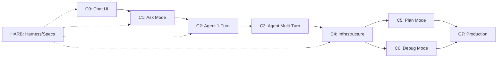

# Agent-K Extension Implementation Tasks

> **Source**: PRD Implementation Runbook + Phase PRDs (C0-C7) + 90 PRD Documents
> **Generated**: 2026-07-25
> **Total Phases**: 8 (C0-C7) + HARB | **Task format**: `tasks/<PHASE>/<ID>.json` (~314) + master index  
> **Related**: C0–C4 완료 표시는 `DONE_TASKS/` · 감사 재작업은 `REWORK_TASKS/` (P0→P2)

---

## 📁 Task File Structure

```
TODO_TASKS/
├── README.md                    # This file
├── MASTER_TASK_INDEX.md         # 전체 태스크 인덱스 + 진행률
└── tasks/
    ├── C0/   # Chat UI + Streaming + Settings Hub 뼈대 (JSON per task)
    ├── C1/   # Ask Mode
    ├── C2/   # Agent Single Turn
    ├── C3/   # Agent Multi-Turn + Interrupt&Resynthesize
    ├── C4/   # Infrastructure
    ├── C5/   # Plan Mode
    ├── C6/   # Debug Mode
    ├── C7/   # Production + Settings Hub 완성
    └── HARB/ # Harness / Specs (병렬)
```

---

## 🎯 Phase 순서 및 의존성 (Critical Path)



| Phase | 의존성 | 예상 기간 | 핵심 산출물 |
|-------|--------|-----------|-------------|
| **C0** | 없음 | 2-3일 | 사이드바 채팅, 스트리밍, 모드, 타임라인, Provider, **Settings Hub 뼈대** |
| **C1** | C0 | 2-3일 | 읽기 도구 8개, 병렬 실행, 프리페치, Ask 모드 화이트리스트 |
| **C2** | C1 | 3-5일 | Search-Replace edit, Diff 승인 UI, 자동 린트 검증, 체크포인트 |
| **C3** | C2 | 3-4일 | 코어 루프, maxTurns, Doom Loop, **Interrupt & Resynthesize** 큐, 에러 복구 |
| **C4** | C3 | 4-5일 | 권한 게이트, 체크포인트 완성, 컴팩션, 훅, Memories, Side Chat |
| **C5** | C4 | 3-4일 | 질문 UI, Mermaid 플랜, Todo 분기, 승인 후 Agent 실행 |
| **C6** | C4 | 4-5일 | 가설/계측/재현/로그/최소수정/청소, Debug 전용 도구 |
| **C7** | C5,C6 | 2-3주 | Browser/Design, Worktree/BoN, Agent Review, MCP, Skills, Artifacts |

---

## 📋 태스크 상태 표기

| 기호 | 의미 |
|------|------|
| `☐` | 미시작 (Not Started) |
| `🔄` | 진행중 (In Progress) |
| `✅` | 완료 (Done) |
| `⏳` | 대기중 (Blocked/Waiting) |
| `🔁` | 재작업 필요 (Rework) |

---

## 🚀 시작 가이드

### 1. 선행 조건 확인
```bash
# Node.js 20+ 확인
node --version  # v20.x.x 이상

# VS Code / Cursor 설치 확인
code --version  # 또는 cursor --version

# 필수 도구
rg --version    # ripgrep (파일 검색용)
git --version
```

### 2. 프로젝트 초기화 (C0 Day 1 오전)
```bash
cd /Users/kong-yujun/workspace/agent-k
# Option A: VS Code Extension Generator
npx --package=yo --package=generator-code yo code
# → TypeScript, ESBuild, Webview (React)

# Option B: 수동 구조 (Runbook 참조)
mkdir -p src/{chat,providers,tools,loop,infrastructure,harness,patch,review,plan,debug,browser,worktree,mcp,memories,skills}
mkdir -p tests/{unit,e2e,bench}
mkdir -p webview dist
```

### 3. 첫 태스크 실행
```bash
# C0 태스크 파일 열기
ls TODO_TASKS/tasks/C0/ && cat TODO_TASKS/tasks/C0/C0-T01.json

# 첫 번째 태스크부터 시작 (확장 스캐폴드 생성)
```

---

## 📊 진행률 추적

전체 진행률은 `MASTER_TASK_INDEX.md`에서 관리합니다.

```bash
# 진행률 요약 보기
grep -c "✅" TODO_TASKS/MASTER_TASK_INDEX.md  # 완료된 태스크 수
grep -c "☐" TODO_TASKS/MASTER_TASK_INDEX.md   # 남은 태스크 수
```

---

## 🔗 관련 문서

| 문서 | 위치 | 용도 |
|------|------|------|
| Implementation Runbook | `PRDs/PRD-Implementation-Runbook.md` | 상세 구현 가이드 |
| Dependency Graph | `PRDs/PRD-Dependency-Graph.md` | 의존성/위상 정렬 |
| Traceability Matrix | `PRDs/PRD-Traceability-Matrix.md` | PRD-스펙 매핑 |
| Master Context | `PRDs/00_Master_Context.md` | 아키텍처/ADR/Quick Start |

---

*각 Phase 태스크 파일은 해당 PRD의 Implementation Checklist + Runbook 상세 단계를 기반으로 생성되었습니다.*

---

## 📝 Changelog

| 버전 | 날짜 | 내용 |
|------|------|------|
| v1.0 | 2026-07-25 | 초기 태스크 생성 (C0–C7 + HARB) |
| v1.1 | 2026-07-25 | C5–HARB 깨진 JSON 복구 · C0 Settings Hub 서브타스크(T33–T39) · C3 Resynthesize(T07/T08/T31/T32) · C7-T46 Settings 완성 · README 경로 정정 |
| v1.2 | 2026-07-25 | Audit follow-up: C4-T21/C3-T28 stale 제거 · C3-T33 debounce · Skills PRD-28 보강 · HARB-T06/T24 · MASTER C3-T20 동기화 |
| v1.3 | 2026-07-25 | **C5–HARB thin stub 전수 enrich** (thin 130→0) · `ask_question`/`.agentk/plans` 정합 · C6-T29 browser evidence 추가 · `scripts/enrich_c5_harb.py` |
| v1.3 | 2026-07-25 | C0-T07 완료 (Stop/Regenerate + 키보드 단축키) · C0-T05/T06 status 정정 · README에 태스크 완료 워크플로우 추가 |
| v1.4 | 2026-07-25 | C0 Bulk: T08(StreamingMarkdownParser) · T09(Shiki CodeBlock) · T10(Mermaid) · T17(ProviderRegistry) · T18(LiteLLMProvider) · T19(ToolCallParser) · T20(ToolResultFormatter) · T21(SecretManager) · T22(ProviderSettings UI) · T23(HealthCheck) · T24(Protocol types) · T26(Theme) · T33(ConfigManager) · T35(SettingsPanel) · T36(ModelsTab) · T38(QueueTab) 완료. 남은 태스크 12개. |

*각 태스크 JSON은 PRD Implementation Checklist + Runbook + 최신 PRD(PRD-17/29 등)를 기준으로 유지합니다.*

---

## ✅ 태스크 완료 워크플로우 (TODO → DONE)

### 진행 순서
1. **태스크 실행** → `TODO_TASKS/tasks/<PHASE>/<ID>.json` 확인
2. **구현 완료 후** → 다음 단계 수행:
   ```bash
   # 1. DONE_TASKS 폴더 생성 (최초 1회)
   mkdir -p DONE_TASKS/<PHASE>
   
   # 2. 태스크 파일 복사 및 상태 업데이트
   cp TODO_TASKS/tasks/<PHASE>/<ID>.json DONE_TASKS/<PHASE>/<ID>.json
   ```
3. **DONE_TASKS/<PHASE>/<ID>.json 수정**:
   - `"status": "pending"` → `"status": "done"`
   - `completedCriteria` 배열 추가 (체크리스트 형태로 완료 항목 기록)
   - `actualHours` 추가 (실제 소요 시간)
   - `implementationNotes` 객체 추가:
     - `completedAt`: 완료 일시 (ISO 8601)
     - `filesModified`: 수정된 파일 목록
     - `verification`: 검증 방법 (예: `npm run compile 성공`)
     - `notes`: 특이사항/이슈/이관 사항
4. **TODO_TASKS에서 삭제**:
   ```bash
   rm TODO_TASKS/tasks/<PHASE>/<ID>.json
   ```
5. **MASTER_TASK_INDEX.md** 업데이트 (해당 태스크 행을 ✅로 변경)

### JSON 필드 예시 (완료 시)
```json
{
  "id": "C0-T06",
  "phase": "C0",
  "title": "스트리밍 파이프라인 (AbortController + 토큰 단위 렌더링)",
  "status": "done",
  "completedCriteria": [
    "✅ 토큰 단위 실시간 렌더링 (청크 단위)",
    "✅ Stop 버튼 클릭 시 즉시 스트림 중단 (< 100ms)",
    "✅ Regenerate 클릭 시 동일 프롬프트로 재시작",
    "✅ 에러 시 스트리밍 상태 정리 (streaming=false)"
  ],
  "actualHours": 3,
  "implementationNotes": {
    "completedAt": "2026-07-25T14:57:00+09:00",
    "filesModified": [
      "src/chat/types.ts (StreamDelta.toolCalls 추가, ProviderConfig.type 필수)",
      "src/chat/api/chatApi.ts (provider config merge 로직 수정)",
      "src/chat/hooks/useChatStream.ts (전면 재작성: 타입 안전성, 시그니처 통일)",
      "src/chat/ChatApp.tsx (regenerate 콜백 시그니처 래퍼 추가)"
    ],
    "verification": "npm run compile 성공 (tsc --noEmit, eslint, esbuild 번들링)",
    "notes": "ChatApp.tsx regenerate 콜백을 Composer onRegenerate 시그니처(인자 없는 함수)에 맞춰 래퍼 함수로 수정. useChatStream의 regenerate는 messages, mode, callbacks 인자 필요."
  }
}
```

### 검증 체크리스트 (이동 전 확인)
- [ ] `npm run compile` 성공 (TypeScript + ESLint + esbuild)
- [ ] `npm run package` 성공 (프로덕션 번들 생성)
- [ ] 관련 테스트 통과 (단위/통합)
- [ ] 구현 노트(`implementationNotes`) 작성 완료
- [ ] `MASTER_TASK_INDEX.md` 진행률 업데이트

---

*Changelog는 하단 참조*
