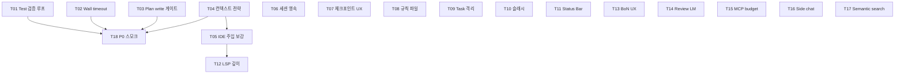

# ADDON Phase — `docs/addon.md` 갭 메우기

> **Source**: [`docs/addon.md`](../../../docs/addon.md) Agent K 필요/부족 분석  
> **Generated**: 2026-07-27  
> **Tasks**: 18 (P0: 6 · P1: 7 · P2: 5)  
> **목적**: C0–C7/HARB로 깔린 코어 위에, 가이드에서 추린 **부족한 제품 갭**만 태스크화

---

## 권장 실행 순서

### P0 (먼저 — 소형 모델 신뢰성)

| ID | 제목 | 예상 h | 의존 |
|----|------|--------|------|
| ADDON-T01 | 관련 테스트 자동 검증 루프 | 6 | — |
| ADDON-T02 | Run/Turn wall-clock 타임아웃 | 4 | — |
| ADDON-T03 | Plan/write 강제 게이트 | 5 | — |
| ADDON-T04 | 작업유형별 컨텍스트 전략 | 6 | — |
| ADDON-T05 | IDE 컨텍스트 안정 주입 | 4 | T04 |
| ADDON-T18 | P0 수용 스모크 | 4 | T01–T04 |

### P1 (제품 완성도)

| ID | 제목 | 예상 h | 의존 |
|----|------|--------|------|
| ADDON-T06 | Session 호스트 영속 통합 | 5 | — |
| ADDON-T07 | 체크포인트 + 롤백 UX | 6 | — |
| ADDON-T08 | 규칙 파일 자동 로드 | 3 | — |
| ADDON-T09 | Task 서브에이전트 격리 | 8 | — |
| ADDON-T10 | 슬래시 명령 UX | 5 | — |
| ADDON-T11 | 토큰·비용 Status Bar | 3 | — |
| ADDON-T12 | LSP 커서 컨텍스트 깊이 | 5 | T05 |

### P2 (확장)

| ID | 제목 | 예상 h | 의존 |
|----|------|--------|------|
| ADDON-T13 | Worktree Best-of-N UX | 8 | — |
| ADDON-T14 | Agent Review LM 루프 | 6 | — |
| ADDON-T15 | MCP deferred 예산 | 4 | — |
| ADDON-T16 | Side chat stub 해소 | 3 | — |
| ADDON-T17 | 시맨틱 검색 기반 | 8 | — |

**합계 예상**: ~93h

---

## 스코프 밖 (태스크 안 만듦)

- B급 도메인(펌웨어/MISRA/시리얼)
- Cloud Agents / 세션 공유 URL
- Tab 고스트 / Cmd+K 제품급
- OpenRouter 전제 재작성

---

## 완료 워크플로

다른 Phase와 동일:

1. `docs/TODO_TASKS/tasks/ADDON/<ID>.json` 구현  
2. `docs/DONE_TASKS/ADDON/<ID>.json`으로 이동 + 증빙  
3. `MASTER_TASK_INDEX.md` 동기화
