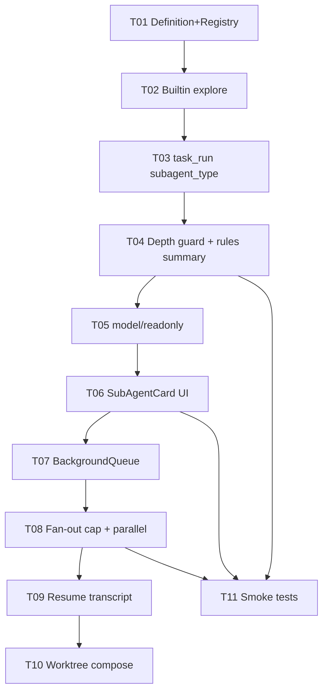

# SUBAG Phase — Subagents (Next Implementation)

> **Source**: [`docs/PRDs/08_Subagents/PRD-Subagents.md`](../../../PRDs/08_Subagents/PRD-Subagents.md)  
> **Generated**: 2026-07-27  
> **Tasks**: 11 (W1: 4 · W2: 2 · W3: 2 · W4: 1 · W5: 1 · QA: 1)  
> **Depends on**: ADDON-T09 (`TaskTool` / `SubAgentResult` 격리 뼈대)  
> **목적**: Context-only 서브에이전트를 Explore/Bash/Browser + MD 레지스트리 수준으로 제품화

---

## 권장 실행 순서

### 한눈에 보는 Next 목록

| Wave | ID | 제목 | P | h | 의존 |
|------|-----|------|---|---|------|
| W1 | **SUBAG-T01** | AgentDefinition + AgentRegistry (MD 로드) | P0 | 4 | — |
| W1 | **SUBAG-T02** | Builtin `explore` (fast / readonly) | P0 | 4 | T01 |
| W1 | **SUBAG-T03** | `task_run`에 `subagent_type` 배선 | P0 | 5 | T02 |
| W1 | **SUBAG-T04** | Depth=1 가드 + PROJECT RULES 요약 주입 | P0 | 3 | T03 |
| W2 | **SUBAG-T05** | model `inherit`/`fast` + readonly 강제 | P1 | 4 | T04 |
| W2 | **SUBAG-T06** | SubAgentCard UI (Cancel / Expand) | P1 | 5 | T03 |
| W3 | **SUBAG-T07** | Background 디스패치 (`is_background`) | P1 | 6 | T05 |
| W3 | **SUBAG-T08** | maxConcurrent + ParallelExecutor 연동 | P1 | 4 | T07 |
| W4 | **SUBAG-T09** | Resume + transcript 영속 | P2 | 6 | T07 |
| W5 | **SUBAG-T10** | `worktree: true` compose (BoN API 재사용) | P2 | 5 | T05 |
| QA | **SUBAG-T11** | 스모크/단위 테스트 + 부모 위임 프롬프트 | P0 | 4 | T04 |

**합계 예상**: ~50h  
**권장 첫 착수**: T01 → T02 → T03 → T04 → T11 (W1+스모크)

---

## Layer 주의

| 이 페이즈 | 하지 말 것 |
|-----------|------------|
| Context isolation (Layer A) | Cloud VM / Agents Window 전체 |
| Explore/shell/browser 내장 | BoN을 서브에이전트로 대체 |
| `.agentk/agents/` + `.cursor/agents/` 호환 | Side chat 부활 |

파일 겹침 병렬 쓰기는 **T10(worktree)** 또는 기존 `/bon` — 일반 `explore`/`general`에 섞지 말 것.

---

## 완료 워크플로

1. AC 충족 + 단위 테스트  
2. JSON을 `docs/DONE_TASKS/SUBAG/`로 이동, `status: done`  
3. `MASTER_TASK_INDEX.md` SUBAG 행 갱신  
4. (선택) `npm run test:subag` 스크립트에 테스트 경로 추가

---

## 외부 참고

- https://cursor.com/docs/subagents.md  
- https://code.claude.com/docs/en/sub-agents  
- https://agentpatterns.ai/tools/cursor/multitask-subagents/
