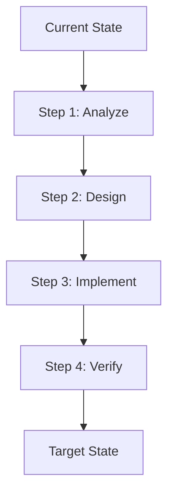

# Plan Mode

## Overview
Plan Mode is Agent-K's design-first workflow. Before making any code changes, you research the codebase, answer clarifying questions, and generate an approved implementation plan.

## Workflow (5 Stages)

```
Research → Questions → Plan → Review → Build
```

### Stage 1: Research 🔍
- Read-only exploration of the codebase
- Allowed tools: `grep`, `glob`, `read_file`, `list_dir`, `codebase_search`, `lsp_definition`, `lsp_references`
- No file writes, no terminal commands
- Results feed into the Plan Generator

### Stage 2: Questions ❓
- Agent asks clarifying questions to understand requirements
- Three question types: `single` (radio), `multiple` (checkbox), `text` (freeform)
- All required questions must be answered before proceeding to planning
- Questions and answers become part of the plan document

### Stage 3: Plan 📋
- Generates a 6-section plan document:
  1. **Context** — Current state and problem definition
  2. **Questions** — Answers to clarifying questions
  3. **Architecture** — Mermaid diagrams (before/after)
  4. **TODOs** — Step-by-step checklist
  5. **Risks** — Risk assessment and mitigations
  6. **Approval** — Sign-off section

### Stage 4: Review 👀
- User reviews the plan in a split-pane editor
- Steps can be removed via checkbox
- Plan content is fully editable (Markdown)
- **Approve & Execute** button to proceed
- All questions must be answered before approval

### Stage 5: Build 🚀
- Switches to Agent mode (write tools enabled)
- Plan context injected into system prompt
- TODO progress tracked per step
- "Per plan step N" context shows progress

## Key Features

### Read-Only Enforcement
- Plan mode tools: `grep`, `glob`, `file_search`, `list_dir`, `read_file`, `codebase_search`, `lsp_definition`, `lsp_references`, `ask_question`, `todo_write`, `switch_mode`
- `edit_file`, `write_file`, `run_terminal_cmd`, `browser_*` are denied
- Double guard: schema filtering + runtime check

### Complexity Heuristic
Automatically suggests Plan mode when:
- Request touches 3+ files (configurable threshold)
- Keywords detected: refactor, migration, architecture, restructure, etc.
- Edit tool called with 5+ hunks

### Plan Storage
- Plans saved to `.agentk/plans/PLAN-<slug>.md`
- Configurable path via `agent-k.plans.directory`
- Recent 10 plans in workspaceState

### Todo Branching
- Right-click a TODO step → Branch to new Agent session
- Only the selected step + plan summary injected
- Parent session unaffected, runs in parallel

### Failure Recovery
If a plan step fails during build:
1. Checkpoint restore reverts changes
2. Returns to Plan Review with error context
3. Adjust plan and re-approve

## Mermaid Template



## Configuration

```json
{
  "agent-k.plans.directory": ".agentk/plans",
  "agent-k.plans.complexityThreshold": 3,
  "agent-k.plans.maxRecentPlans": 10
}
```
